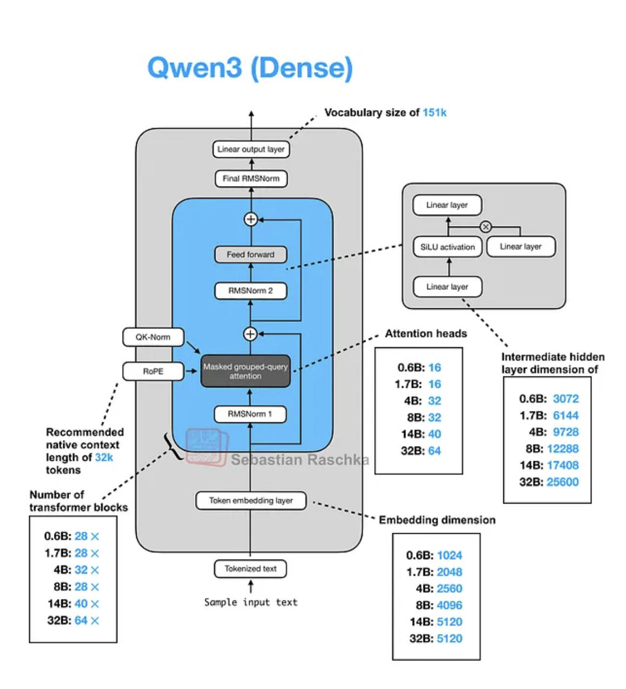

# Qwen3-0.6B Training on AWS Trn2 with Neuron SDK

Team: Ananya, Sara

This repository provides a complete setup for training Qwen3-0.6B models on AWS Trainium (Trn2) instances using the AWS Neuron SDK.

## Overview



- **Model**: Qwen3-0.6B (0.6B parameters, 0.44B non-embedding)
- **Hardware**: AWS Trn2 instances
- **Framework**: PyTorch with AWS Neuron SDK
- **Precision**: BF16
- **Context Length**: 32,768 tokens (extendable to 40,960)

## Quick Start

1. **Setup Environment**
   ```bash
   chmod +x scripts/setup.sh
   ./scripts/setup.sh
   source ~/.neuron_env
   ```

2. **Install Dependencies**
   ```bash
   pip install -r requirements.txt
   ```

3. **Configure Training**
   ```bash
   cp configs/qwen3_0.6b_config.yaml configs/my_config.yaml
   # Edit configs/my_config.yaml with your settings
   ```

4. **Start Training with Auto-Stop**
   ```bash
   # Train for 1 minute then auto-stop (testing)
   python src/train.py --config configs/my_config.yaml --auto-stop 60

   # Train for 1 hour then auto-stop
   python src/train.py --config configs/my_config.yaml --auto-stop 3600

   # Train without auto-stop
   python src/train.py --config configs/my_config.yaml
   ```

## Auto-Stop Feature

Train with automatic instance shutdown to control costs:

```bash
# Launch script with 1-minute auto-stop
./scripts/launch_training.sh -m 1

# Or use Python directly
python src/train.py --config configs/my_config.yaml --auto-stop 60
```

## Documentation

- **[Complete Deployment Guide](docs/DEPLOYMENT_GUIDE.md)** - Full walkthrough from EC2 launch to training
- **[Quick Start Guide](docs/QUICK_START.md)** - Condensed reference for experienced users

## Repository Structure

```
├── configs/                 # Training configurations
│   ├── qwen3_0.6b_config.yaml
│   └── neuron_config.yaml
├── scripts/                 # Setup and utility scripts
│   ├── setup.sh
│   ├── launch_training.sh
│   └── monitor.sh
├── src/                     # Source code
│   ├── train.py            # Main training script
│   ├── model.py            # Model definition
│   ├── data_loader.py      # Data loading utilities
│   └── utils.py            # Helper functions
├── data/                    # Training data
├── docs/                    # Documentation
└── requirements.txt         # Python dependencies
```

## Model Configuration

Based on the Qwen3-0.6B architecture:
- **Total Parameters**: 0.6B (0.44B non-embedding)
- **Layers**: 28
- **Attention Heads**: 16 (Query), 8 (Key/Value)
- **Hidden Size**: 1024
- **Intermediate Size**: 3072
- **Vocab Size**: 151936

## AWS Trn2 Instance Types

Recommended instance types for Qwen3-0.6B:
- `trn2.xlarge` (1 Trainium chip, 32GB memory) - **Recommended** for 0.6B model
- `trn2.8xlarge` (1 Trainium chip, 128GB memory) - For larger batch sizes
- `trn2.48xlarge` (6 Trainium chips, 768GB memory) - For multi-chip distributed training

## Optimization
- Uses XLA compiler optimizations
- Implements gradient accumulation for larger effective batch sizes
- Utilizes mixed precision training with BF16
- Supports tensor parallelism and data parallelism
- **Gradient Checkpointing**: Memory optimization
- **Dynamic Loss Scaling**: For numerical stability
- **Monitoring**: Real-time metrics and logging

## Prerequisites

- AWS EC2 Trn2 instance (recommended: trn2.xlarge or trn2.8xlarge for 0.6B model)
- Python 3.8+
- AWS Neuron SDK 2.x

## Installation
```bash
# Install AWS Neuron SDK
pip install torch-neuronx neuronx-cc

# Install project dependencies
pip install -r requirements.txt

# Install project in development mode
pip install -e .
